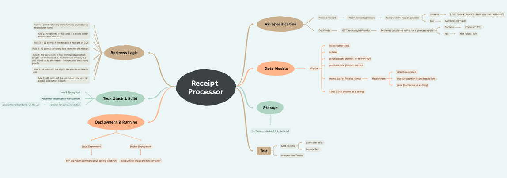
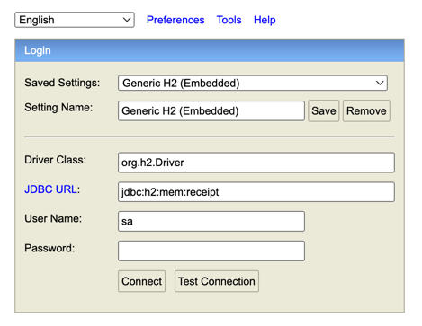

# Receipt Processor API

This project implements a web service that processes receipts and calculates points based on a set of business rules. It is built with Java, Spring Boot, and Spring Data JPA, and uses an H2 in-memory database. The project is also Dockerized for containerized deployment.

## Overview

The Receipt Processor API exposes two main endpoints:

- **POST `/receipts/process`**  
  Accepts a JSON receipt payload, stores it in the H2 database, and returns a generated receipt ID (UUID).

- **GET `/receipts/{id}/points`**  
  Retrieves the receipt by its ID, calculates points based on business rules, and returns the points.

For more information, visit the [SwaggerHub]https://app.swaggerhub.com/apis/northeasternuniversi-18a/receipt-processor/1.0.0#/default/post_receipts_process.

## Project Structure
```
├── .github/
│   └── workflows/
│       └── maven-build.yml
├── .idea/
├── .mvn/
├── src
│   ├── main
│   │   ├── java
│   │   │   └── com
│   │   │       └── springdemo
│   │   │           └── receiptprocessoronline
│   │   │               ├── ReceiptProcessorOnlineApplication.java
│   │   │               ├── exception
│   │   │               │   ├── ExceptionHandlerAdvice.java
│   │   │               │   ├── ObjectNotFoundException.java
│   │   │               ├── receipt
│   │   │               │   ├── ReceiptController.java
│   │   │               │   ├── Receipt.java
│   │   │               │   ├── ReceiptItem.java
│   │   │               │   ├── ReceiptRepository.java
│   │   │               │   ├── ReceiptService.java
│   │   │               ├── system
│   │   │               │   ├── DBDataInitializer.java
│   │   │               │   ├── IdData.java
│   │   │               │   ├── PointsData.java
│   │   │               │   ├── Result.java
│   │   │               │   ├── StatusCode.java
│   │   ├── resources
│   │   │   ├── static/
│   │   │   ├── templates/
│   │   │   ├── application.yml
│   │   │   ├── data.sql  # (Optional for preloading test data)
│   ├── test
│   │   ├── java
│   │   │   └── com
│   │   │       └── springdemo
│   │   │           └── receiptprocessoronline
│   │   │               ├── receipt
│   │   │               │   ├── ReceiptControllerTest.java
│   │   │               │   ├── ReceiptServiceTest.java
│   │   │               ├── ReceiptProcessorOnlineApplicationTests.java
├── target   
├── images
├── .gitattributes
├── .gitignore
├── Dockerfile
├── HELP.md
├── mvnw
├── mvnw.cmd
├── pom.xml
├── README.md
├── External Libraries/
└── Scratches and Consoles/
```

## Design Mind Map
The receipt processor is designed based on the following components:


## Installation
1. **Clone the repository:**
  ```
    git clone git@github.com:BeileiTan/receipt-processor.git
    cd receipt-processor
   ```
2. **mvn build package:**
    ```
    ./mvnw package -DskipTests
    ```
3. **Build the Docker image:**
    ```
    docker build -t tcu/receipt-processor-online:1.0 . 
    ```
4. **Run the Docker container:**
   ```
   docker run -d -p 8080:8080 tcu/receipt-processor-online:1.0
   ```
The service will be accessible on port ocalhost:8080.

## API Endpoints
### Process Receipt
* Endpoint: POST /receipts/process
* Description: Accepts a JSON receipt payload and stores it in the H2 database. Returns a generated receipt ID (UUID).
* Example of curl Request for valid input:
```
curl -X POST http://localhost:8080/receipts/process \
     -H "Content-Type: application/json" \
     -d '{
        "retailer": "Target",
        "purchaseDate": "2022-01-01",
        "purchaseTime": "13:01",
        "items": [
          {
            "shortDescription": "Mountain Dew 12PK",
            "price": "6.49"
          },{
            "shortDescription": "Emils Cheese Pizza",
            "price": "12.25"
          },{
            "shortDescription": "Knorr Creamy Chicken",
            "price": "1.26"
          },{
            "shortDescription": "Doritos Nacho Cheese",
            "price": "3.35"
          },{
            "shortDescription": "   Klarbrunn 12-PK 12 FL OZ  ",
            "price": "12.00"
          }
        ],
        "total": "35.35"
     }'
```
* The ideal output format will be:
```
{
    "flag": true,
    "code": 200,
    "message": "Add Success",
    "data": {
        "id": "1888023878115135488"
    }
}
```
* curl Request for invalid input(missing argument):
```
curl -X POST http://localhost:8080/receipts/process \
     -H "Content-Type: application/json" \
     -d '{
        "retailer": "",
        "purchaseDate": "",
        "purchaseTime": "13:01",
        "items": [
          {
            "shortDescription": "Mountain Dew 12PK",
            "price": "6.49"
          },{
            "shortDescription": "Emils Cheese Pizza",
            "price": "12.25"
          },{
            "shortDescription": "Knorr Creamy Chicken",
            "price": "1.26"
          },{
            "shortDescription": "Doritos Nacho Cheese",
            "price": "3.35"
          },{
            "shortDescription": "   Klarbrunn 12-PK 12 FL OZ  ",
            "price": "12.00"
          }
        ],
        "total": "35.35"
     }'
```
* The output format will be:
```
{
    "flag": false,
    "code": 400,
    "message": "Provide arguments here",
    "data": {
        "retailer": "retailer is required.",
        "purchaseDate": "purchaseDate is required."
    }
}
```
### Get Points
* Endpoint: GET /receipts/{id}/points
* Description: Retrieves the receipt by its ID and returns the calculated points.
* Example of curl Request for valid input(which is pre-stored in the H2 database)
```
curl http://localhost:8080/receipts/adb6b560-0eef-42bc-9d16-df48f30e89b2/points
```
* The ideal output format will be:
```
{
    "flag": true,
    "code": 200,
    "message": "Find One Success",
    "data": {
        "point": 95
    }
}
```
* curl Request for non-existing id:
```
curl http://localhost:8080/receipts/adb6b560-42bc-9d16-df48f30e89b2/points
```
* The output format will be:
```
{
    "flag": false,
    "code": 404,
    "message": "No receipt found for that id 0eef-42bc-9d16-df48f30e89b2 :(",
    "data": null
}
```

## Database
This project uses H2 as an in-memory database during development. 
The H2 console is available at http://localhost:8080/h2-console. 
l choose H2 because it is lightweight, fast, and easy to configure, making it ideal for development and testing environments where data persistence is not required. 
For more information, see below:

One receipt with id: adb6b560-0eef-42bc-9d16-df48f30e89b2 has been pre-stored in database for the test purpose.

## Testing
Unit tests are used to ensure the correctness of the application and are integrated into a continuous integration pipeline, which are triggered on every pull request before merging.